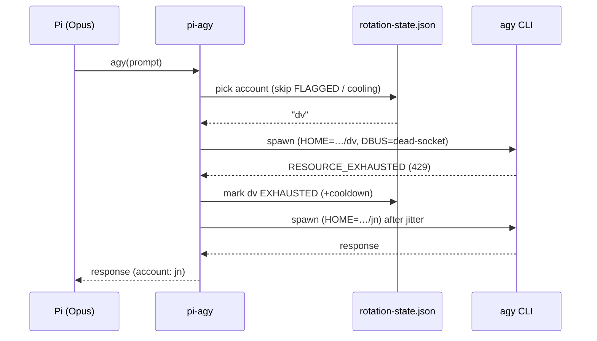
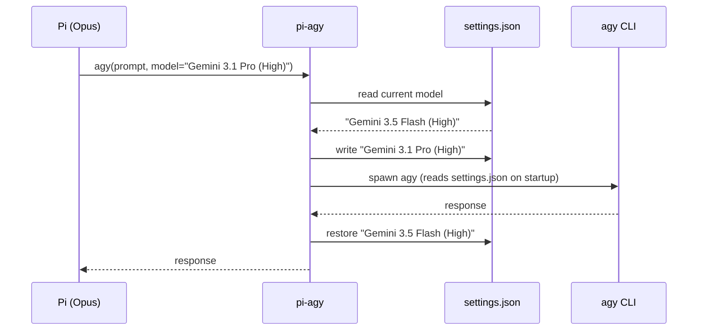
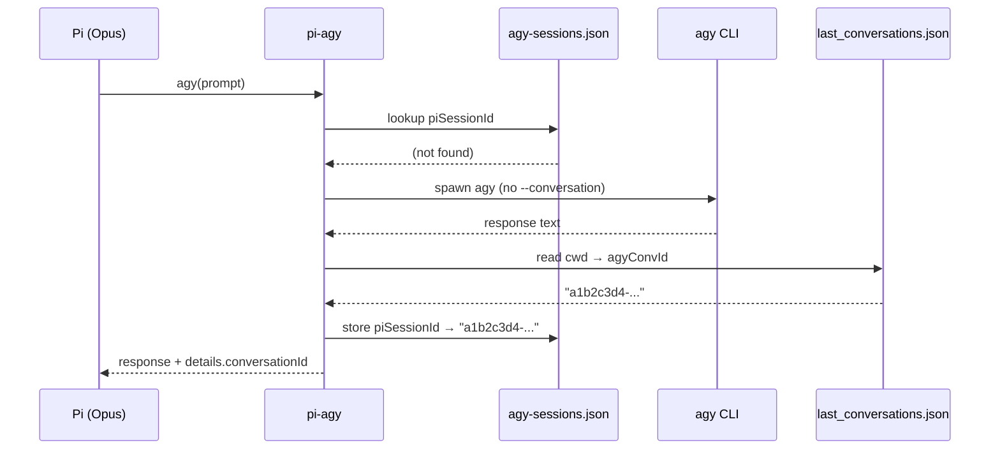
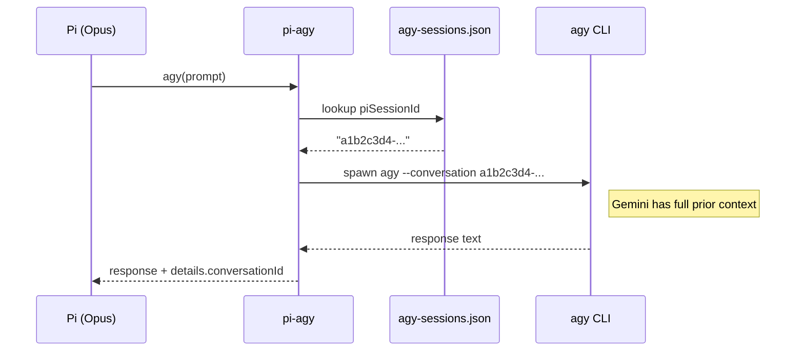
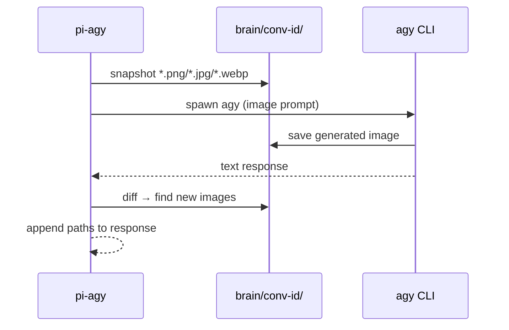

<p align="center">
  
</p>

# pi-agy

Pi extension that wraps Google's Antigravity CLI (`agy`) as native LLM-callable tools. Opus delegates tasks to Gemini Flash without thinking about CLI flags, model selection, or account state.

## Requirements

- **Linux or macOS** (Windows is not supported — see [Limitations](#limitations))
- `agy` on PATH (Google Antigravity CLI)
- Logged in once via `agy` TUI (OAuth)
- Model selected via `agy` TUI `/model` (inherited by all `-p` calls)

## Installation

Add to `~/.pi/agent/settings.json`:

```json
{
  "packages": ["../../src/pi-agy"]
}
```

Or symlink into the global extensions directory:

```bash
ln -s ~/src/pi-agy ~/.pi/agent/extensions/pi-agy
```

Then `/reload` in Pi or start a new session.

## Tools

### `agy`

Send any prompt to Gemini. Write it however you like — nothing is added by the extension.

```
prompt:          "You are a senior security engineer. Review this code for injection vulnerabilities..."
contextFiles:    ["src/auth.ts", "src/middleware.ts"]   # 1–3 targeted files, injected as <file> blocks
contextDir:      "src"                                  # whole directory via --add-dir, no size limit
timeoutSec:      240                                    # always set explicitly — see Timeout guidance below
conversationId:  "e973694d-85e4-..."                     # optional: resume a specific conversation
model:           "Gemini 3.1 Pro (High)"                   # optional: override model for this call
```

**`contextFiles` vs `contextDir`**

| | `contextFiles` | `contextDir` |
|---|---|---|
| Mechanism | file contents inlined in prompt via stdin | `--add-dir` → agy workspace |
| Size limit | none (stdin, not argv) | none |
| Use for | 1–3 targeted files | whole dirs, many files |

### `agy_image`

Send a prompt + image file to Gemini (PNG, JPG, WebP, GIF).

```
imagePath:  "screenshots/mockup.png"
prompt:     "Convert this to a React + Tailwind component"
timeoutSec: 120   # optional, default 120
model:      "Gemini 3.1 Pro (High)"  # optional
```

The image is copied to an isolated temp directory before passing to agy, so only the target file is exposed to Gemini.

Also supports `conversationId` for continuing a prior conversation.

### `agy_usage`

Show the local call counter.

```
window:  "today" | "week" | "month" | "all"   # optional, default "week"
account: "work"                                # optional, filter by profile
```

Soft-warns at 50 calls/day or 200/week. Never blocks calls. Counter is local only — does not reflect Google's server-side quota.

### Account detection

agy authenticates via the OS keyring and doesn't always update `google_accounts.json` (e.g. after re-authenticating in the TUI). The extension detects the real authenticated email by parsing agy's `--log-file` output after every call (`applyAuthResult: email=...`). If the detected email differs from `google_accounts.json`, the file is updated automatically. To switch accounts, re-authenticate in the agy TUI (`agy` → `/login`).

## Account rotation

**Optional, opt-in.** When you have multiple pre-authenticated Google accounts, pi-agy can automatically rotate to the next account when one hits a quota / `429` error — so a single exhausted account doesn't block your work. Rotation is **off** unless `~/.pi/agy-rotation.config.json` exists; with no config, behavior is identical to single-account mode.

### Setup

1. **Pre-authenticate each account in its own HOME directory.** Each account is a separate `HOME` where agy stores its OAuth token at `$HOME/.gemini/antigravity-cli/antigravity-oauth-token`. Disable the OS keyring (so agy falls back to the on-disk token) by pointing D-Bus at a dead socket, then log in once per account:
   ```sh
   export HOME=/home/youruser/.ag-acp/accounts/dv
   export DBUS_SESSION_BUS_ADDRESS=unix:path=/tmp/ag-acp-no-keyring-main
   agy            # → /login, authenticate as this account
   ```
   Repeat for each account, each with a distinct `HOME`.
2. **Create the config.** Copy the example and edit the account paths:
   ```sh
   cp agy-rotation.config.example.json ~/.pi/agy-rotation.config.json
   # edit accounts[].home → your absolute account HOME paths
   ```
3. **Restart pi** (or `/reload`).

### Config (`~/.pi/agy-rotation.config.json`)

See [`agy-rotation.config.example.json`](agy-rotation.config.example.json).

| Field | Required | Default | Meaning |
|---|---|---|---|
| `accounts[]` | **yes** | — | Ordered pool. Each entry: `name` (`/^[a-zA-Z0-9_-]+$/`) + absolute `home`. Duplicate names or homes are rejected. |
| `dbusAddress` | no | `unix:path=/tmp/ag-acp-no-keyring-main` | Dead-socket D-Bus address injected per spawn to disable the keyring. |
| `dailySoftCap` | no | `90` | Advisory per-account daily request cap (warns near the empirical ~200/day WAF threshold; never hard-blocks). |
| `defaultCooldownSec` | no | `60` | Cooldown applied to a `429`'d account when the log carries no parseable retry-after. |
| `protectivePauseHours` | no | `6` | Global pause across the whole pool after a `403`/ToS signal. |
| `jitterMs` | no | `[400, 1200]` | `[min, max]` randomized delay between cross-account retries (human-like pacing). |

Invalid optional numbers fall back to their default; a **missing/empty `accounts[]` or a present-but-invalid config disables rotation and logs a warning to stderr** (distinct from "absent = silent").

### How it works

On a quota / `429` error the extension marks the account `EXHAUSTED` (with a cooldown), then switches to the next account by overriding `HOME` + `DBUS_SESSION_BUS_ADDRESS` on the spawned agy process and retrying — drain-then-switch, **reactive only**.



Anti-ban guardrails (derived from empirical quota/ban analysis):

- **No-hammer** — the same account is never retried within one call; re-hitting a `429`'d account is what escalates a `429` into a permanent `403` ToS ban. Retry budget is capped at pool size.
- **Cooldown respected** — `EXHAUSTED` accounts are skipped until `cooldownUntil`.
- **`403`/ToS ⇒ permanent `FLAGGED` + 6h global pause** across the whole pool (dodges the same WAF rules).
- **Advisory daily cap** (`dailySoftCap`) and **jittered** retries for human-like pacing.
- **All accounts exhausted** ⇒ a clean `retry after Ns` error, never a busy-loop.
- Concurrent tool calls in one pi process are serialized by an in-process mutex.

### Pin a specific account

Pass `account` on `agy` / `agy_image` to force one account for that call (bypasses rotation, but still respects the global `403` pause):

```
account: "dv"
```

### Status & caveats

- **Conversation continuation is disabled while rotation is on** — each rotated call starts a fresh agy conversation (a conversation is bound to the account HOME that created it). Cross-account session sharing is a planned fast-follow (see `.pi-project/feat-auto-switch-429.md` §12).
- The `403`/ToS detection regex is **provisional** until validated against a real ban log; ambiguous logs are classified as `quota` (rotate + cooldown), which is safer than a wrongful 6h pause.
- Account credentials are never copied or printed — only the per-spawn `HOME` differs.

## Model selection

Pass `model` to override the active model for a single call:

```
model: "Gemini 3.1 Pro (High)"
```

Available models (exact names from the agy TUI):

| Model | Notes |
|---|---|
| Gemini 3.5 Flash (High) | Default if not changed |
| Gemini 3.5 Flash (Medium) | |
| Gemini 3.5 Flash (Low) | |
| Gemini 3.1 Pro (High) | |
| Gemini 3.1 Pro (Low) | |
| Claude Sonnet 4.6 (Thinking) | |
| Claude Opus 4.6 (Thinking) | |
| GPT-OSS 120B (Medium) | |

The override is temporary — the original model is restored after the call. Running interactive agy sessions are unaffected (they read settings once on startup).

### How model switching works

agy has no `--model` CLI flag and no environment variable override. The active model is stored in `~/.gemini/antigravity-cli/settings.json`:

```json
{ "model": "Gemini 3.5 Flash (High)" }
```



If the requested model's quota is exhausted, agy's print mode silently falls back to another model instead of erroring. The extension detects this by parsing `RESOURCE_EXHAUSTED` from agy's `--log-file` and returns `isError: true`:

```
⚠ Quota exhausted for Claude Sonnet 4.6 (Thinking): Individual quota reached
```

**Known limitation:** if Pi crashes between the settings swap and the restore, `settings.json` retains the overridden model. The next agy call (or TUI session) will use that model until manually changed via `/model`.

## Conversation continuation

Each pi session gets its own agy conversation. Gemini retains full context from prior `agy` and `agy_image` calls within the same session — no need to re-explain what you're working on.

Multiple pi sessions sharing the same working directory are fully isolated: each talks to its own Gemini conversation.

| `conversationId` | Behavior |
|---|---|
| _(omitted)_ | Auto-continue this pi session's conversation |
| `"<uuid>"` | Resume a specific conversation by ID |
| `"new"` | Force a fresh conversation (no prior context) |

The conversation UUID is returned in `details.conversationId` on every response, so you can store it and pass it back later.

### New session (no mapping yet)



### Continue (mapping exists)



The mapping in `~/.pi/agy-sessions.json` survives pi restarts, so resumed sessions pick up where they left off. Stale entries are pruned on extension load.

## Image generation

agy can generate images when prompted. The extension automatically detects new images after each call and appends their file paths to the response:

```
I have generated the image...

Generated images:
/home/user/.gemini/antigravity-cli/brain/a1b2c3d4-.../fisherman_at_dawn_123456.png
```

The paths are also available in `details.generatedImages[]` for programmatic use.

### How it works



agy saves images to `~/.gemini/antigravity-cli/brain/<conversation-id>/`. The extension knows the conversation ID from the session mapping, so it only checks the relevant directory.

## Timeout guidance

Always set `timeoutSec` explicitly — the default (120s) is only safe for simple one-shot questions.

**Estimate:** `120 + (files × 15)` seconds, then double for deep analysis tasks.

| Task | Files | Estimate |
|------|-------|----------|
| Quick question | 0 | 120s |
| Small code review | 3 | ~165s |
| Security audit, 10 files | 10 | ~420s |
| Full directory audit | 20+ | 600s+ |

> **agy FREE / PRO tiers can be 3–5× slower.** When in doubt, be generous — agy returns as soon as it's done regardless of the timeout value.

## Limitations

- **Windows** — not supported. The extension uses `which` for CLI discovery and Unix-style paths (`~/.local/bin/agy`). Contributions welcome.
- **Model selection** — agy has no `--model` CLI flag. The extension swaps `~/.gemini/antigravity-cli/settings.json` before each call and restores it after. If pi crashes mid-call, the settings file may retain the overridden model.
- **No streaming** — `agy -p` returns output only on completion.
- **Image generation** — agy can generate images, but `-p` mode only returns text confirmation (no binary data on stdout). The extension detects new images and returns their paths — see [Image generation](#image-generation).
- **Conversation auto-continue** — session mapping relies on `~/.pi/agy-sessions.json` (pi→agy) and `~/.gemini/antigravity-cli/cache/last_conversations.json` (first-call discovery). If either is unavailable, each call starts a fresh conversation (graceful degradation). **Disabled while [account rotation](#account-rotation) is on** — each rotated call starts fresh until cross-account session sharing lands (fast-follow).

## Development

```bash
npm run check   # biome lint + tsc --noEmit
```

No build step — Pi loads `.ts` source directly.
